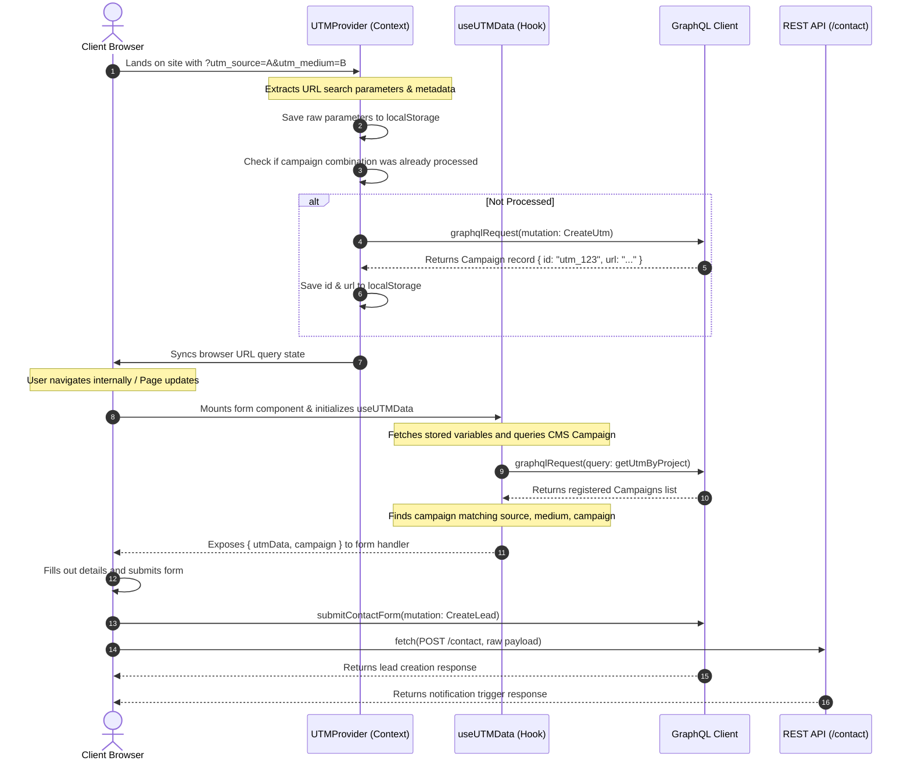

# UTM Tracking System: Technical Architecture & Implementation Guide

This document provides a comprehensive technical architecture and implementation guide for the UTM Tracking and Campaign Sync System, reverse-engineered from Project A. The goal of this system is to capture, persist, sync, and send UTM tracking parameters from incoming URL requests to the database, ensuring lead attribution remains accurate across multiple sessions, tabs, and pages.

---

## 1. Overall Architecture

The UTM Tracking System uses a **client-side first, hybrid storage and background API synchronization** architecture. It is built to run seamlessly inside Next.js (App Router) and integrates directly with a CMS (via GraphQL) and external REST API endpoints.

At a high level:
1. **Detection & Injection**: The application listens to incoming traffic. If a user lands with UTM parameters in their URL, they are immediately captured.
2. **Local Persistence**: Captured UTM parameters are stored in `localStorage` for cross-page persistence. If the user navigates to pages *without* UTMs, the system automatically restores them back into the browser's URL using Next.js routing and standard History APIs.
3. **Internal Navigation**: A custom `UTMLink` component preserves URL query parameters between clicks, preventing visual flickering during client-side hydration.
4. **Backend Campaign Registration**: When a new combination of UTM parameters is detected, the app automatically checks the CMS. If the campaign combination does not exist, a new record is created in the CMS via a GraphQL mutation. The unique ID of the CMS Campaign is then attached locally to the stored UTM parameters (`utm_id`).
5. **Form Submission Attribution**: When a user submits an enquiry (Visitor, Exhibitor, Brochure, or Sponsor), the UTM data (both raw parameters and CMS campaign fields) are injected into the form payload and sent to the GraphQL API to create a `Lead` record, as well as a secondary REST API endpoint for notifications.

```
Incoming URL with UTMs (e.g. ?utm_source=google)
         │
         ├──► 1. Google Analytics (gtag) Tracks User Properties
         │
         └──► 2. UTMProvider (Root Wrapper)
                    │
                    ├──► Stores in localStorage ('utm_data')
                    │
                    ├──► Calls getOrCreateUTMInCMS()
                    │          │
                    │          ├──► GraphQL: mutation CreateUtm
                    │          └──► Stores assigned Campaign ID locally
                    │
                    └──► Syncs/Restores URL parameters on route changes
                             │
                             └──► (Synchronizes with UTMLink in Navbar)
```

---

## 2. Complete Flow Diagram

The sequence below illustrates the lifecycle of a user landing with UTM query parameters, navigating the site, and submitting a form.

```mermaid
graph TD
    A[User visits website with UTM parameters] --> B{UTM parameters in URL?}
    B -- Yes --► C[Extract UTM parameters]
    B -- No --► D{Stored UTMs in localStorage?}
    
    D -- Yes --► E[Restore UTMs to URL query string]
    D -- No --► F[No UTM tracking active]
    
    C --> G[Store UTM parameters in localStorage]
    G --> H[Sync UTM parameters to current URL history state]
    H --> I[Check CMS: Has this Campaign been registered?]
    
    I -- No --► J[GraphQL: Create UTM record in CMS]
    J --> K[Get unique CMS Campaign ID]
    K --> L[Update localStorage with utm_id & utm_url]
    
    I -- Yes --► M[Use existing CMS Campaign ID]
    
    L --> N[User navigates internally using UTMLink]
    M --> N
    
    N --> O[URL UTM parameters preserved in address bar]
    O --> P[User opens Registration / Enquiry form]
    P --> Q[Hook: useUTMData extracts local storage & URL UTMs]
    Q --> R[Submit form: Payload packages fields + UTM attribution]
    
    R --> S[GraphQL API: mutation CreateLead]
    R --> T[REST API: POST to /contact]
    
    S --> U[Lead created in CMS DB linked to Campaign ID]
    T --> V[Fallback Notification trigger completed]
```

---

## 3. Folder Structure

The relevant files for the UTM tracking implementation are structured as follows:

```
tyre-expo/
├── app/
│   ├── layout.tsx                   # Injects Google Analytics + UTM tracking & wraps with UTMProvider
│   ├── providers.tsx                # Wraps layout with general providers (Toaster)
│   ├── sponsorship-enquiry/
│   │   └── page.tsx                 # Form component submitting sponsorship leads with UTM parameters
│   └── register/
│       └── forms/
│           ├── BrochureForm.tsx     # Form component submitting brochure download leads with UTMs
│           ├── EnquiryForm.tsx      # Form component submitting general visitor enquiry leads with UTMs
│           └── ExhibitorForm.tsx    # Form component submitting exhibitor enquiry leads with UTMs
├── components/
│   ├── UTMProvider.tsx              # Context-like provider managing URL synchronization & CMS registration
│   ├── UTMDebugger.tsx              # Overlay panel displaying active UTM parameters in development/staging
│   └── common/
│       └── Navbar.tsx               # Implements UTMLink to preserve UTM variables during internal clicks
├── hooks/
│   └── useUTMTracker.ts             # Custom Hooks (useUTMTracker, useUTMData) for retrieving UTM details
├── lib/
│   ├── utmTracker.ts                # Pure utilities for extracting, storing, and generating UTM links
│   ├── cms-utm.ts                   # Queries and mutations interacting with CMS campaigns
│   └── graphql-client.ts            # Core GraphQL client handling lead submissions & query definitions
└── .env                             # Environment variables configuration file
```

---

## 4. File-by-File Explanation

### 1. `lib/utmTracker.ts`
* **File Path**: [lib/utmTracker.ts](file:///c:/Users/91935/OneDrive/Desktop/MAX%20business%20media/TypeExpoProject/tyre-expo/lib/utmTracker.ts)
* **Purpose**: Provides pure, environment-aware utility functions for extracting, storing, updating, and formatting UTM parameters.
* **Why it exists**: Isolates DOM and localStorage operations into reusable methods. Ensures that operations only run on the client side (`typeof window !== 'undefined'`) to prevent Next.js hydration/pre-rendering errors.
* **Interactions**: Imported by `components/UTMProvider.tsx`, `hooks/useUTMTracker.ts`, `components/UTMDebugger.tsx`, and `app/layout.tsx`.
* **Execution Flow**:
  - `getUTMParamsFromSearchParams(searchParams)`: Iterates through defined tracking keys (`utm_source`, `utm_medium`, `utm_campaign`, `utm_term`, `utm_content`, `utm_id`) and extracts values from the React `URLSearchParams` object.
  - `getUTMParams()`: Fetches query parameters directly from `window.location.search`.
  - `storeUTMData(data)`: Merges new UTM variables into any existing `'utm_data'` object inside `localStorage`. Fires a `utm_data_updated` `CustomEvent` to notify other components/tabs in real-time.
  - `syncUTMParamsToUrl(utmData)`: Modifies browser history on the fly via `window.history.replaceState` without triggering a full page reload.

### 2. `components/UTMProvider.tsx`
* **File Path**: [components/UTMProvider.tsx](file:///c:/Users/91935/OneDrive/Desktop/MAX%20business%20media/TypeExpoProject/tyre-expo/components/UTMProvider.tsx)
* **Purpose**: Coordinates URL state synchronization and manages CMS registration of new UTM campaign records.
* **Why it exists**: Serves as a persistent wrapper around the application layout, ensuring UTM parameter checking runs automatically on every path or query change.
* **Interactions**: Imported by [layout.tsx](file:///c:/Users/91935/OneDrive/Desktop/MAX%20business%20media/TypeExpoProject/tyre-expo/app/layout.tsx). Calls utilities from [utmTracker.ts](file:///c:/Users/91935/OneDrive/Desktop/MAX%20business%20media/TypeExpoProject/tyre-expo/lib/utmTracker.ts) and functions from [cms-utm.ts](file:///c:/Users/91935/OneDrive/Desktop/MAX%20business%20media/TypeExpoProject/tyre-expo/lib/cms-utm.ts).
* **Execution Flow**:
  - When the component mounts or routes transition (`searchParams` or `pathname` changes):
    1. **Restoration**: If `localStorage` contains UTM details but the URL query string has none, it formats the stored data and updates the route using `router.replace(...)`.
    2. **Detection**: Extracts UTM parameters from `searchParams` (falling back to `window.location.search`). Automatically appends browser metadata (`referrer`, `landingPage`, `timestamp`).
    3. **Deduplication Check**: Inspects `localStorage` to check if a campaign with the exact same `utm_source`, `utm_medium`, and `utm_campaign` was already processed.
    4. **Persistence & Syncing**: Calls `storeUTMData(utmParams)` and updates the URL parameters via `syncUTMParamsToUrl(utmParams)`.
    5. **CMS Creation**: If the campaign was not already registered, it calls `getOrCreateUTMInCMS(utmParams)`. Once completed, it updates local storage with the generated campaign `id` and the short URL `url`.

### 3. `lib/cms-utm.ts`
* **File Path**: [lib/cms-utm.ts](file:///c:/Users/91935/OneDrive/Desktop/MAX%20business%20media/TypeExpoProject/tyre-expo/lib/cms-utm.ts)
* **Purpose**: Coordinates communication with the CMS's GraphQL API specifically for querying and registering UTM campaign records.
* **Why it exists**: Separates campaign business logic from front-end layout rendering, handling API failures, URL protocol validation, and GraphQL errors gracefully.
* **Interactions**: Imported by `components/UTMProvider.tsx` and `hooks/useUTMTracker.ts`. Calls backend client helper `graphqlRequest` from `lib/graphql-client.ts`.
* **Execution Flow**:
  - `fetchUTMByProject()`: Submits the GraphQL query `getUtmByProject` using the configure project ID to retrieve all registered campaigns.
  - `getUTMFromCMS(utmData)`: Inspects project campaign records to find a match where `source`, `medium`, and `campaign` fields are identical (case-insensitive).
  - `getOrCreateUTMInCMS(utmData)`:
    1. Attempts to locate an existing match via `getUTMFromCMS`.
    2. If missing, validates and sanitizes values (lowercases everything, converts URL to a valid absolute HTTP/S string, defaulting to a fallback URL if invalid).
    3. Submits `createUtm` GraphQL mutation.
    4. **Race Condition Prevention**: If the mutation returns errors containing `"UTM already exists"` or `"Unique constraint"`, it intercepts the error and returns the pre-existing record from the CMS.

### 4. `hooks/useUTMTracker.ts`
* **File Path**: [hooks/useUTMTracker.ts](file:///c:/Users/91935/OneDrive/Desktop/MAX%20business%20media/TypeExpoProject/tyre-expo/hooks/useUTMTracker.ts)
* **Purpose**: React hooks allowing components to consume active UTM parameters and campaign records.
* **Why it exists**: Provides an easy abstraction for forms to load UTM values without repeating logic.
* **Interactions**: Imported by page and form components. Calls utilities from `lib/utmTracker.ts` and `lib/cms-utm.ts`.
* **Execution Flow**:
  - `useUTMData()`:
    1. Triggers on mount and route changes.
    2. Introduces a **50ms delay** via `setTimeout` to allow the URL router parameters to resolve completely before reading.
    3. Reads from the URL query string first. If found, caches in storage.
    4. If URL params are missing, falls back to `localStorage` retrieval.
    5. Updates state. In the background, calls `getUTMFromCMS` to get the campaign record.

### 5. `components/common/Navbar.tsx`
* **File Path**: [components/common/Navbar.tsx](file:///c:/Users/91935/OneDrive/Desktop/MAX%20business%20media/TypeExpoProject/tyre-expo/components/common/Navbar.tsx)
* **Purpose**: Renders navigation and implements active query preservation.
* **Why it exists**: Normal links (`<a>` or standard `<Link>`) drop query strings when clicked. This file provides an inline utility to carry tracking params through internal clicks.
* **Interactions**: Utilizes Next.js navigation components.
* **Execution Flow**:
  - `useUTMQueryString()`: Extracts UTM parameters from `useSearchParams()` and compiles them into a URL-encoded string.
  - `UTMLink`: A wrapper component. If the target `href` is internal, it appends the compile query string (e.g. `/register/` becomes `/register/?utm_source=...`) before rendering.

### 6. `lib/graphql-client.ts`
* **File Path**: [lib/graphql-client.ts](file:///c:/Users/91935/OneDrive/Desktop/MAX%20business%20media/TypeExpoProject/tyre-expo/lib/graphql-client.ts)
* **Purpose**: Core GraphQL request client and form submission helper.
* **Why it exists**: Centralizes HTTP POST requests to the GraphQL endpoint, attaches headers, parses responses, and formats raw forms into DB schema inputs.
* **Interactions**: Imported by `lib/cms-utm.ts` and form components.
* **Execution Flow**:
  - `graphqlRequest(query, variables)`: Performs standard fetch calls to `NEXT_PUBLIC_CMS_GRAPHQL_ENDPOINT` with JSON payloads.
  - `submitContactForm(projectId, input)`: Receives a unified form payload. Maps fields to `CreateLeadInput` schema. Maps `formType` to a standard backend `LeadType` enum. Attaches tracking fields (`utmSource`, `utmMedium`, `utmCampaign`, `utmTerm`, `utmContent`, `utmId`, `utmUrl`) and executes the `CreateLead` mutation.

### 7. `app/layout.tsx`
* **File Path**: [app/layout.tsx](file:///c:/Users/91935/OneDrive/Desktop/MAX%20business%20media/TypeExpoProject/tyre-expo/app/layout.tsx)
* **Purpose**: The root Next.js wrapper containing scripts and DOM layouts.
* **Why it exists**: Initializes global tracking systems and mounts the `UTMProvider` around child pages.
* **Interactions**: Imports `UTMProvider` and `UTMDebugger` components, and `getUTMParams` from utilities.
* **Execution Flow**:
  - Sets up Google Tag Manager/Google Analytics scripts (`gtag`).
  - Executes inline GA initialization. The function `trackUTMParameters()` parses `window.location.search`, registers UTM query params inside GA user properties, and fires a `utm_parameters_detected` event.
  - On page load / route changes, it checks if `gtag` is initialized, calls `getUTMParams()`, and triggers a pageview config event.
  - Renders `<UTMProvider>` as a layout sibling, ensuring children have access to synchronized parameters.

### 8. `components/UTMDebugger.tsx`
* **File Path**: [components/UTMDebugger.tsx](file:///c:/Users/91935/OneDrive/Desktop/MAX%20business%20media/TypeExpoProject/tyre-expo/components/UTMDebugger.tsx)
* **Purpose**: Development helper component.
* **Why it exists**: Visually displays active tracking state in the bottom corner of the browser window.
* **Interactions**: Subscribes to window custom events and storage events.
* **Execution Flow**:
  - Mounts in the DOM. Subscribes to `'utm_data_updated'` and `'storage'` event listeners.
  - Renders a floating panel showing current `Source`, `Medium`, `Campaign`, `Term`, `Content`, `Campaign ID`, `Referrer`, and `Landing` details if UTM data is detected.

---

## 5. Data Flow

Here is the exact technical data path:

```
[Incoming Request] ──► URL: /register?utm_source=Newsletter&utm_medium=email&utm_campaign=Spring_Launch
                           │
                           ▼ (Next.js useSearchParams / window.location.search)
[UTMProvider] ───────► Extracts UTMs:
                           {
                             utm_source: "Newsletter",
                             utm_medium: "email",
                             utm_campaign: "Spring_Launch"
                           }
                           │
                           ▼ (Normalized & saved to localStorage key 'utm_data')
[localStorage] ──────► Saved Payload:
                           {
                             utm_source: "newsletter",
                             utm_medium: "email",
                             utm_campaign: "spring_launch",
                             referrer: "https://t.co/",
                             landingPage: "https://tyre-expo.com/register?...",
                             timestamp: "2026-07-09T10:30:00.000Z"
                           }
                           │
                           ▼ (CMS lookup & mutation CreateUtm)
[GraphQL CMS] ───────► Returns registered Campaign Record:
                           {
                             id: "utm_rec_abc123",
                             url: "https://tyre-expo.com/register"
                           }
                           │
                           ▼ (Merge & update local storage)
[localStorage] ──────► Updated Stored Payload:
                           {
                             ...,
                             utm_id: "utm_rec_abc123",
                             utm_url: "https://tyre-expo.com/register"
                           }
                           │
                           ▼ (User fills Enquiry Form and submits)
[EnquiryForm] ───────► Combines Form values with hook useUTMData() into Payload
                           │
                           ▼ (Map to CreateLeadInput)
[graphql-client] ────► submitContactForm() Payload structure:
                           {
                             projectId: "cmr0bbzha0000g10iozials1f",
                             name: "John Doe",
                             email: "john@example.com",
                             leadType: "VISITOR",
                             utmSource: "newsletter",
                             utmMedium: "email",
                             utmCampaign: "spring_launch",
                             utmId: "utm_rec_abc123",
                             utmUrl: "https://tyre-expo.com/register"
                           }
```

---

## 6. UTM Capture Logic

The system handles UTM parsing by looking at Next.js `useSearchParams()` for React state changes, falling back directly to pure browser query parsing if Server-Side Rendering (SSR) context is active.

```typescript
// From lib/utmTracker.ts
export function getUTMParamsFromSearchParams(searchParams?: URLSearchParams): UTMData {
    const utmParams: UTMData = {};
    if (!searchParams) return utmParams;

    const utmKeys = ['utm_source', 'utm_medium', 'utm_campaign', 'utm_term', 'utm_content', 'utm_id'] as const;
    utmKeys.forEach(key => {
        const value = searchParams.get(key);
        if (value) utmParams[key] = value;
    });

    return utmParams;
}

export function getUTMParams(): UTMData {
    if (typeof window === 'undefined') return {}; // Prevents SSR crashes

    const urlParams = new URLSearchParams(window.location.search);
    const utmParams: UTMData = {};

    const utmKeys = ['utm_source', 'utm_medium', 'utm_campaign', 'utm_term', 'utm_content', 'utm_id'] as const;
    utmKeys.forEach(key => {
        const value = urlParams.get(key);
        if (value) utmParams[key] = value;
    });

    return utmParams;
}
```

---

## 7. Storage Logic

### Local Storage Schema
The storage key is `'utm_data'`. The serialized JSON value contains:
- `utm_source`: lowercased tracking source
- `utm_medium`: lowercased tracking medium
- `utm_campaign`: lowercased campaign name
- `utm_term`: optional lowercased keyword
- `utm_content`: optional lowercased ad content
- `utm_id`: unique campaign ID returned by the CMS
- `utm_url`: shortened URL or redirection target returned by the CMS
- `referrer`: the document referrer URL
- `landingPage`: the landing page absolute URL
- `timestamp`: ISO String tracking when the parameters were captured

### State Dispatching (Same-Tab Notification)
Since Next.js routes dynamically, client components in the same tab might be mounted concurrently. To update hooks immediately when UTM parameters change, a custom window event is dispatched:

```typescript
export function storeUTMData(data: UTMData) {
    if (typeof window === 'undefined') return;

    const existing = getStoredUTMData();
    const merged = { ...existing, ...data };

    try {
        localStorage.setItem('utm_data', JSON.stringify(merged));

        // Create and dispatch event
        const event = new CustomEvent('utm_data_updated', { detail: merged });
        window.dispatchEvent(event);
    } catch (error) {
        console.error('Error storing UTM data:', error);
    }
}
```

---

## 8. Context/Provider Flow

The `UTMProvider` checks, synchronizes, and registers campaign parameters:

```typescript
useEffect(() => {
    // 1. URL Restore Flow
    try {
        const stored = getStoredUTMData();
        const hasStored = hasUTMData(stored);
        const currentSearch = typeof window !== 'undefined' ? new URLSearchParams(window.location.search) : null;
        const urlHasAny = currentSearch ? UTM_KEYS.some((k) => currentSearch.has(k)) : false;

        if (hasStored && !urlHasAny && pathname) {
            const merged = new URLSearchParams(typeof window !== 'undefined' ? window.location.search : '');
            UTM_KEYS.forEach((k) => {
                const v = stored[k as keyof UTMData];
                if (v && !merged.has(k)) merged.set(k, v as string);
            });
            const newQuery = merged.toString();
            router.replace(`${pathname}${newQuery ? `?${newQuery}` : ''}`);
        }
    } catch {}

    // 2. Detection & CMS Sync Flow
    const handleUTMDetection = async () => {
        const utmParams: UTMData = getUTMParamsFromSearchParams(searchParams);
        if (Object.keys(utmParams).length === 0 && typeof window !== 'undefined') {
            Object.assign(utmParams, getUTMParams());
        }

        // Attach browser metadata
        if (typeof document !== 'undefined') utmParams.referrer = document.referrer || '';
        if (typeof window !== 'undefined') {
            utmParams.landingPage = window.location.href;
            utmParams.timestamp = new Date().toISOString();
        }

        const hasActualUtm = UTM_KEYS.some((key) => !!utmParams[key as keyof UTMData]);

        if (hasActualUtm) {
            const storedUtm = getStoredUTMData();
            const isAlreadyProcessed = !!(
                storedUtm.utm_id &&
                storedUtm.utm_source === utmParams.utm_source &&
                storedUtm.utm_medium === utmParams.utm_medium &&
                storedUtm.utm_campaign === utmParams.utm_campaign
            );

            storeUTMData(utmParams);
            syncUTMParamsToUrl(utmParams);

            if (!isAlreadyProcessed) {
                try {
                    const campaign = await getOrCreateUTMInCMS(utmParams);
                    if (campaign) {
                        setCampaignData(campaign);
                        storeUTMData({ utm_id: campaign.id, utm_url: campaign.url });
                    }
                } catch (error) {
                    console.warn('CMS UTM check/create failed:', error);
                }
            }
        }
    };
    handleUTMDetection();
}, [searchParams, pathname]);
```

---

## 9. Form Submission Flow

When a user submits a form:
1. The form calls the hook `const { utmData, campaign } = useUTMData()`.
2. When the user clicks "Submit", a unified payload is created, combining input values, UTM fields, and CMS campaign details:

```typescript
const payload = {
  email: formData.workEmail,
  formType: "exhibitor-enquiry",
  // ...other profile inputs...

  utmSource: utmData?.utm_source || "",
  utmMedium: utmData?.utm_medium || "",
  utmCampaign: utmData?.utm_campaign || "",
  utmTerm: utmData?.utm_term || "",
  utmContent: utmData?.utm_content || "",
  utmId: utmData?.utm_id || "",
  referrer: utmData?.referrer || "",
  landingPage: utmData?.landingPage || "",
  utmTimestamp: utmData?.timestamp || "",

  cmsCampaignId: campaign?.id || "",
  cmsCampaignName: campaign?.name || "",
  cmsCampaignSource: campaign?.utm_source || "",
  cmsCampaignMedium: campaign?.utm_medium || "",
};
```

3. It triggers `submitContactForm(PROJECT_ID_VAR.projectId, payload)`, which executes the GraphQL mutation.
4. It calls a REST endpoint fetch POST to `/contact` for fallback notification triggers.

---

## 10. GraphQL/API Flow

### Queries and Mutations
All interactions use standard POST requests to `process.env.NEXT_PUBLIC_CMS_GRAPHQL_ENDPOINT`.

```graphql
# 1. Fetch campaigns linked to Project ID
query GetUtmByProject($id: String!) {
    getUtmByProject(id: $id) {
        id
        source
        medium
        campaign
        term
        content
        url
        projectId
        createdAt
        updatedAt
    }
}

# 2. Register a new campaign
mutation CreateUtm($input: CreateUtmInput!) {
    createUtm(input: $input) {
        id
        source
        medium
        campaign
        term
        content
        url
        projectId
        createdAt
        updatedAt
    }
}

# 3. Create a lead record
mutation CreateLead($input: CreateLeadInput!) {
    createLead(input: $input) {
        id
        email
    }
}
```

---

## 11. Backend Flow

1. **GraphQL API (`graphqlRequest`)**:
   - Executes mutations and queries. Returns `{ data, errors }`.
   - Headers: `'Content-Type': 'application/json'`.
2. **REST fallback (`/contact`)**:
   - Posts the full tracking payload directly to `${NEXT_PUBLIC_API_URL}/contact` for backup CRM pipelines or slack notifications.

---

## 12. Database Mapping

Based on the schemas and code structure, the database contains these tables:

### 1. `UtmRecord`
Stores unique campaign parameter sets.

| Field Name | Type | Description | Constraints |
| :--- | :--- | :--- | :--- |
| `id` | String | Unique ID | Primary Key |
| `projectId` | String | CMS project workspace relation | Foreign Key / Index |
| `source` | String | Lowercased UTM Source | Required |
| `medium` | String | Lowercased UTM Medium | Required |
| `campaign` | String | Lowercased UTM Campaign | Required |
| `term` | String | Lowercased UTM Term keyword | Nullable |
| `content` | String | Lowercased UTM Content variant | Nullable |
| `url` | String | Landing Page Redirection Target | Required (defaults to Fallback URL) |
| `createdAt` | DateString | Creation Timestamp | Required |
| `updatedAt` | DateString | Modification Timestamp | Nullable |

*Index & Constraint*: Unique composite constraint on `(projectId, source, medium, campaign, term, content)`.

### 2. `Lead`
Stores submitted user contacts.

| Field Name | Type | Description | Constraints |
| :--- | :--- | :--- | :--- |
| `id` | String | Unique Lead ID | Primary Key |
| `projectId` | String | Project relation | Foreign Key |
| `email` | String | Visitor Email address | Required |
| `name` | String | Contact Full Name | Required |
| `leadType` | Enum | Standard categories (`VISITOR`, `EXHIBITOR`, `BROCHURE`, `SPONSOR`, `OTHER`) | Required |
| `companyName`| String | Associated Company | Nullable |
| `jobTitle` | String | Associated Job Title | Nullable |
| `phone` | String | Phone/Mobile Number | Nullable |
| `country` | String | Location Country | Nullable |
| `state` | String | Location State | Nullable |
| `city` | String | Location City | Nullable |
| `message` | String | Description message/comments | Nullable |
| `source` | Enum | Lead Source categorization (Mapped to `WEBSITE_UTM`) | Required |
| `status` | Enum | State machine progress (Mapped to `NEW`) | Required |
| `utmSource` | String | Attribution raw Source | Nullable |
| `utmMedium` | String | Attribution raw Medium | Nullable |
| `utmCampaign`| String | Attribution raw Campaign | Nullable |
| `utmTerm` | String | Attribution raw Term keyword | Nullable |
| `utmContent` | String | Attribution raw Content | Nullable |
| `utmId` | String | Attribution ID matching `UtmRecord.id` | Nullable / Relation |
| `utmUrl` | String | Attribution landing URL or page referrer | Nullable |

---

## 13. Sequence Diagram

This diagram visualizes the timeline of API interactions and client-side processing:



---

## 14. Edge Cases

1. **Hydration Mismatches (SSR vs CSR)**:
   Next.js pre-renders HTML on the server. If the server reads URL query values or `localStorage` during initial compilation, the output would mismatch the browser's view.
   *Solution*: The hook and utilities restrict direct `window` and `localStorage` checks using `typeof window === 'undefined'` checks. Additionally, the hook uses a **50ms delayed timer** inside `useEffect` (which only executes on the client) to read variables safely.
2. **Race Conditions in Next.js Router**:
   During transitions between internal routes, URL search parameters might lag behind pathnames.
   *Solution*: The 50ms delay in `useUTMData`'s mount effect ensures that path transitions complete and query variables settle before reading them.
3. **Database Unique Key Violation on Race Condition**:
   If a user opens multiple pages with identical UTM parameters in quick succession, multiple instances of the provider will invoke `getOrCreateUTMInCMS()` simultaneously.
   *Solution*: The API returns GraphQL unique index violation errors (such as `"UTM already exists"` or `"Unique constraint"`). The front-end catches this error, intercepts it, and safely falls back to calling `getUTMFromCMS()` to grab the original Campaign ID.
4. **Broken protocol fallback**:
   If referrer pages contain malformed or local dev URLs, the CMS API could crash.
   *Solution*: The parsing function `toAbsoluteUrl` checks URLs against valid protocols (`http:`, `https:`) and drops `localhost` or malformed strings, replacing them with a safe fallback URL (`https://tyre-expo.vercel.app/`).
5. **No UTM Parameters Present**:
   If a user visits directly without parameters, the system searches `localStorage` for any stored history to restore tracking details. If nothing exists, it handles undefined variables gracefully without breaking forms.

---

## 15. Business Rules

1. **Case-Insensitive Normalization**:
   UTM parameters must be normalized (lowercased) before storing in local storage or saving to the database to prevent duplicate campaigns like `Google` and `google`.
2. **Attribution Preservation**:
   Once a user has UTM parameters stored, they are preserved across all page views. Navigating internally does not overwrite them unless new, distinct UTM parameters are passed in the URL query string.
3. **Attribution Priority**:
   Query parameters in the URL take highest priority. Only if the current URL has no tracking details does the system fall back to `localStorage`.

---

## 16. Dependencies

The implementation relies on:
1. **Next.js (App Router)**: Router (`next/navigation`) hooks: `usePathname()`, `useSearchParams()`, `useRouter()`.
2. **Google Analytics (`gtag`)**: Global tracker scripts for user property assignment.
3. **GraphQL Client (`fetch`)**: Handles POST requests to the GraphQL endpoint.
4. **React Hooks**: `useState`, `useEffect`, `useCallback`, `useSuspense`.

---

## 17. Required Environment Variables

Add these variables to the client-side `.env` configuration file:

```ini
# Base URL for parallel REST notification API
NEXT_PUBLIC_API_URL=http://localhost:5000/api

# GraphQL CMS target endpoint
NEXT_PUBLIC_CMS_GRAPHQL_ENDPOINT=https://business-cms-1aks.onrender.com/graphql

# Project identification code required for querying and creating records
NEXT_PUBLIC_CMS_PROJECT_ID=cmr0bbzha0000g10iozials1f
```

---

## 18. Reusable Components

### 1. `UTMProvider`
Place this component at the top of your layout structure. Wrap application providers inside it to enable background tracking immediately.

### 2. `UTMDebugger`
Attach this inside `layout.tsx` next to `UTMProvider` to ease development tracking. Keep it conditional or styles hidden in production deployments.

### 3. `UTMLink` (Inside Navbar)
A drop-in replacement for standard `<Link>` components in layout headers/footers to preserve query variables when routing.

---

## 19. Things That Must Not Be Changed

1. **50ms Delay inside Hooks**:
   Removing the delay causes the hooks to read query strings before Next.js fully hydrates the router, returning empty tracking attributes.
2. **Lowercasing Conversion**:
   Keep `toLowerCase()` conversion active. Deleting it will bypass unique database constraints, resulting in duplicate campaigns.
3. **URL protocol validator (`toAbsoluteUrl`)**:
   Required because malformed referrers crash database URL schemas.
4. **Unique Index Catch Block (`isAlreadyExists` inside `cms-utm.ts`)**:
   Essential to prevent system failures when concurrent requests attempt to register the same tracking data.

---

## 20. Potential Improvements

1. **Cookie Redundancy Fallback**:
   If local storage is blocked by user privacy configurations, data is lost.
   *Improvement*: Implement cookie fallback storage for higher retention.
2. **Server-Side Middleware Capture**:
   Instead of waiting for client rendering, use Next.js Edge Middleware (`middleware.ts`) to capture tracking keys directly on request headers, setting cookies instantly.
3. **Debounced CMS Queries**:
   Implement query batching/caching inside `getUTMFromCMS` to avoid multiple server roundtrips when navigating rapidly.

---

## 21. Step-by-Step Implementation Checklist

1. [ ] Define environment variables in `.env`.
2. [ ] Create type definitions and core trackers inside `lib/utmTracker.ts`.
3. [ ] Build GraphQL queries, schema payloads, and backend connection in `lib/graphql-client.ts`.
4. [ ] Build database query interfaces and logic helpers inside `lib/cms-utm.ts`.
5. [ ] Define `useUTMData` and `useUTMTracker` custom hooks in `hooks/useUTMTracker.ts`.
6. [ ] Create visual helpers inside `components/UTMDebugger.tsx`.
7. [ ] Build synchronization wrapper inside `components/UTMProvider.tsx`.
8. [ ] Wrap Layout body with `<UTMProvider>` in `app/layout.tsx`.
9. [ ] Create or override links inside navigation files using custom `UTMLink` components.
10. [ ] Inject hook `useUTMData()` into visitor/contact forms.
11. [ ] Modify forms submission logic to package tracking fields with the payload.
12. [ ] Verify lead attributions visually using `UTMDebugger` and inspect database records.
